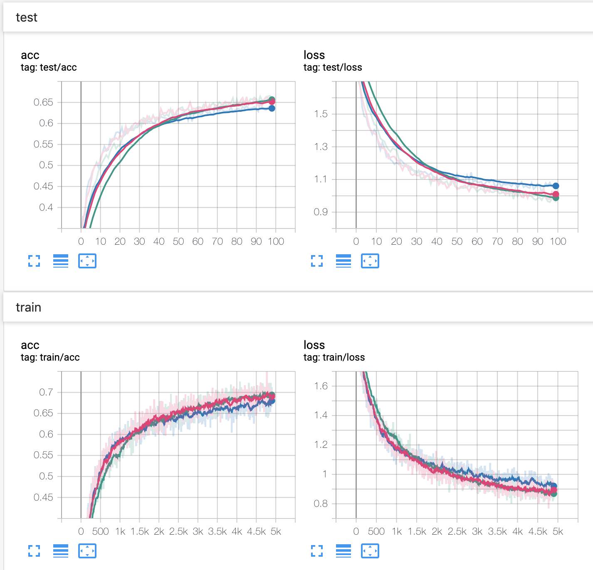

# SE_attention
Implementation of [Squeeze and Excitation](http://openaccess.thecvf.com/content_cvpr_2018/papers/Hu_Squeeze-and-Excitation_Networks_CVPR_2018_paper.pdf) attention mechanism and compare it with a baseline implementation of training a LENET network with the CIFAR10 dataset in Pytorch.

The results show that applying SE module after each convolutional layer gives better results in terms of accuracy and time-convergence. The results are shown in the graphics below and in the explanation that follows them.

> The blue curve is the base LeNet trained on Cifar10 dataset.

> The pink curve is when applying the SE module to just one of the convolutional layer of the main baseline.

> The green curve is when applying the SE module to all the convolutional layers. 